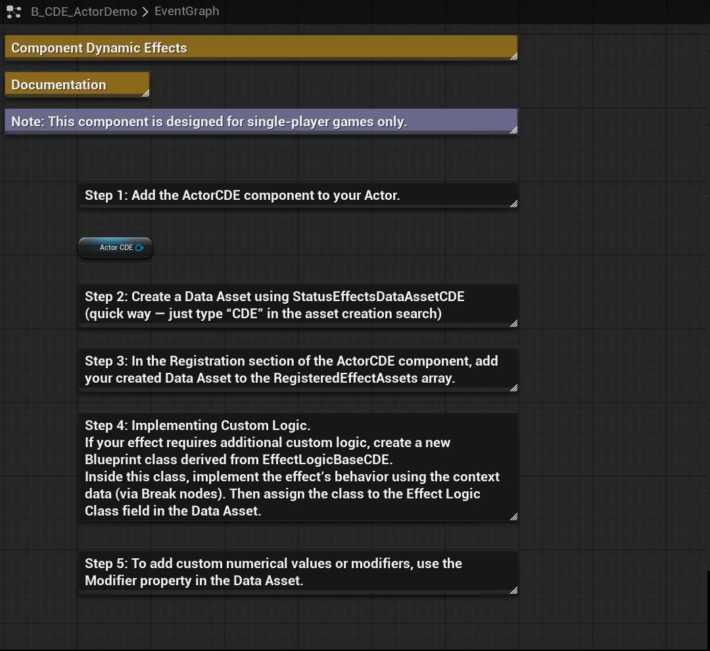
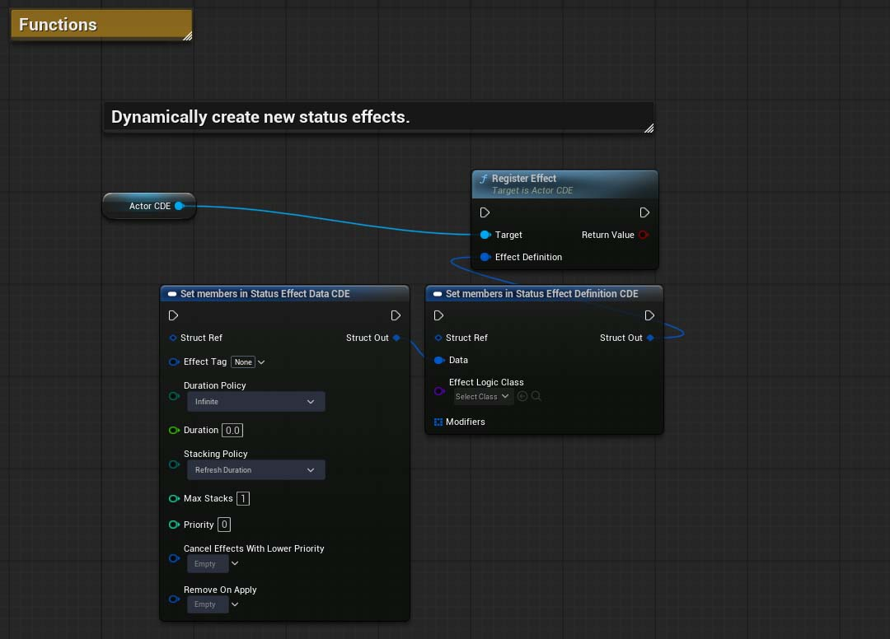
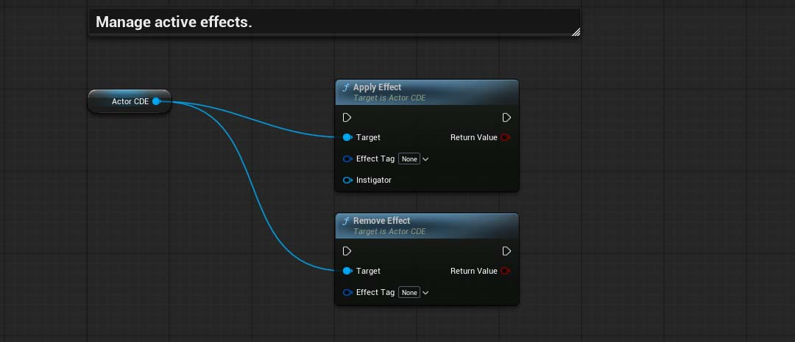
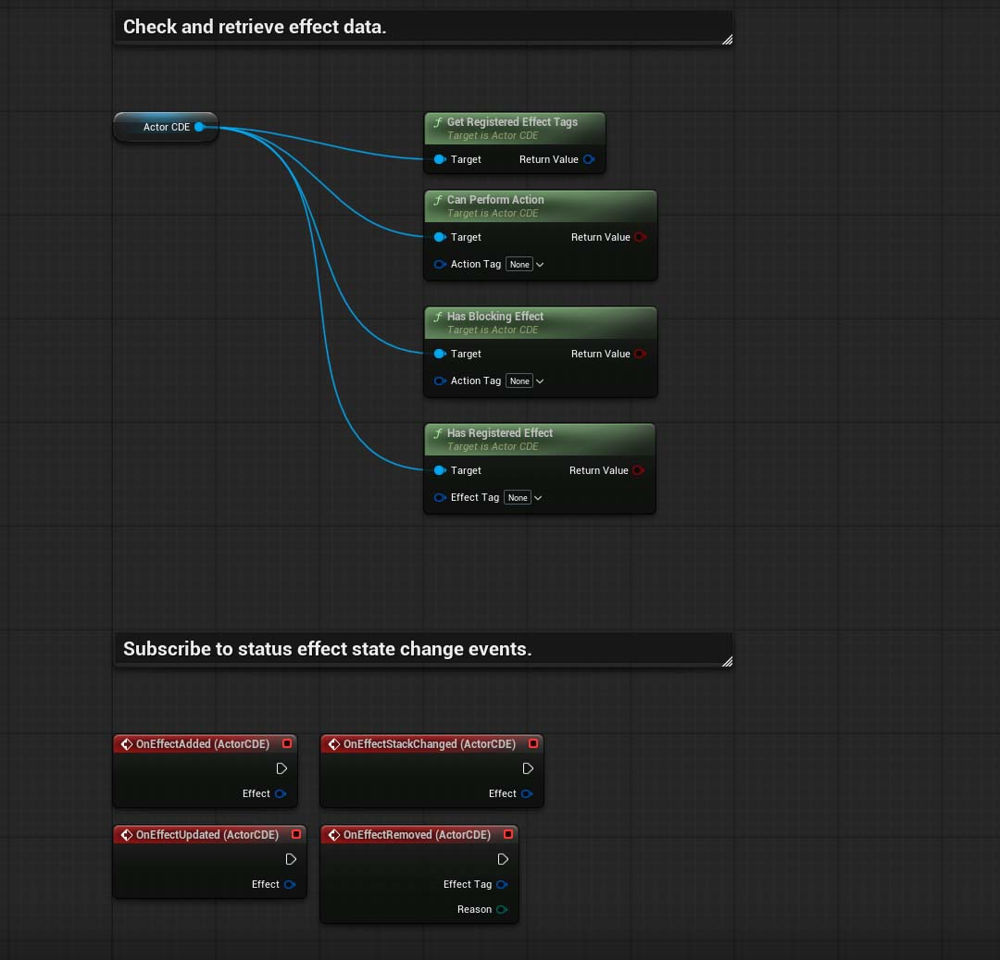

# Component Dynamic Effects
Unreal Engine 5 Actor Component for managing dynamic status effects in single-player games. This is a greatly simplified version of Unreal Engine’s Gameplay Ability System (GAS), designed to make creating single-player games much easier and more accessible.

 

> [!NOTE]
> The plugin has been pre-packaged only for Win64 and Android.

## Latest Updates
`Experimental`

`Version 1.0.1`
- Built for Unreal Engine 5.7.4.
- Added effect collections.
- Added the ability to block effects with other effects.
- Maintained backward compatibility with previous versions of the plugin.

## What it's for
- Dynamic management of status effects.

## Features
- Support for dynamic creation of status effects.
- Encapsulated logic with rich context data.
- Quick search by typing "CDE" — easily find all related classes and functions. No need to remember long function names — simply type “CDE” in the search box and start creating!

## Install

> [!NOTE]
> Starting with Unreal Engine version 5.6, it is recommended to use the new project type based on C++. After copying the plugin folder, be sure to perform a full project rebuild in your C++ IDE.

1. Make sure the Unreal Engine editor is closed.
2. Move the "Plugins" folder to the root folder of your created project.
3. Rebuild the project in your C++ IDE.
4. Done! The 'Component Dynamic Effects' folders should appear in the Unreal Engine browser and the plugin should be automatically activated. If the plugin folder is not visible, activate visibility through the browser settings: `Settings > Show Plugin Content`.

## How to use it?
An interactive step-by-step tutorial on how to use CDE can be found in the file: `B_CDE_ActorDemo`, which is located at the path `Plugins\ComponentDynamicEffects\`.

## (C++) Documentaion
All sources contain self-documenting code.
